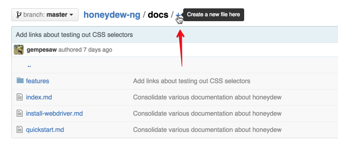
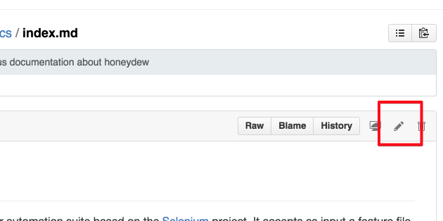
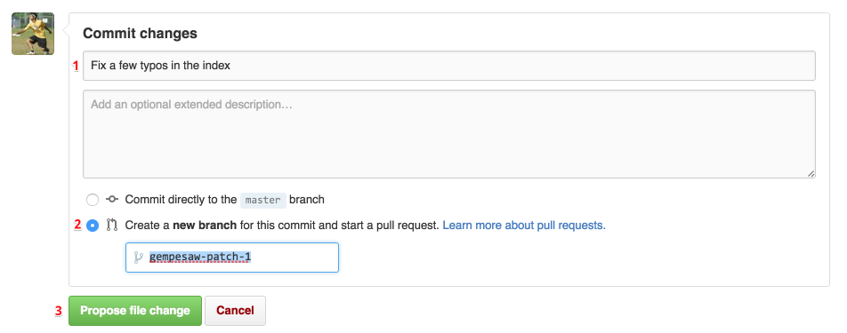

# Contributing

Thanks for contributing to the docs! Here's how to go about it.

1.  [Make a Github.com account][join]. Optionally, tell me your
    username and we'll get you added into the Honeydew organization.

2.  Open up the Honeydew frontend repository and go to
    [the `docs` folder.][docs] This is where the documentation
    Honeydew is stored.

    The documentation is written in Markdown format, which is similar
    to the markup that we use in Confluence. For example, **\*bold\***
    and _\_italics\__ work the same in both systems. Here are a couple
    good resources for learning about the basics:
    [Github Markdown Basics][mdbasic1] and
    [Mastering Markdown][mdbasic2]. This document itself is written in
    markdown - you can see its [raw source][raw] in the Github
    repository as well.

3.  To add an entirely new section of the site, click on the +.  Name
    your file after your section with the file extension `.md` and put
    in some markdown.

    

    To edit an existing file, click on the filename to open it up, and
    then click on the pencil to go into the editor.

    

    Go ahead and do the thing! (write the docs, fix the typo, correct
    the mistake, save the cheerleader, save the world).

4.  Once you're done creating/making your changes, it's time to fill
    out the form at the bottom. There are three final steps (it's
    okay, one of them is clicking a button)

    

    First, put in a short summary of your changes. If you want to get a
    gold star, keep it less than 50 chars, use present tense, and
    start with a capital letter, as suggested in [this article](commitrules).

    Next, switch the radio button to make a new branch for a Pull
    Request, instead of committing to master. (No worries if you
    forget to do this step :).

    Finally, Click that green button and you're off! We'll have someone review
    the changes and they'll go out in the next frontend push! Thanks
    so much!

Let us know if anything on this page is unclear or if you have any
questions!

[join]: https://github.com/join
[docs]: https://github.com/honeydew-sc/honeydew-ng/tree/master/docs
[mdbasic1]: https://help.github.com/articles/markdown-basics/
[mdbasic2]: https://guides.github.com/features/mastering-markdown/
[raw]: https://raw.githubusercontent.com/honeydew-sc/honeydew-ng/master/docs/contributing.md
[commitrules]: http://tbaggery.com/2008/04/19/a-note-about-git-commit-messages.html
