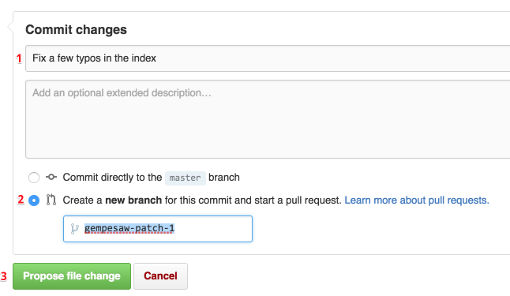

# Contributing

Thanks for contributing to the docs! Here's how to go about it.

1.  [Make a Github.com account][join]. Optionally, tell me your
    username and we'll get you added into the Honeydew organization.

2.  Navigate to any page in the docs, scroll to the bottom, and use
    the "Edit this page in Github" link!

    Go ahead and do your thing! (write the docs, fix the typo, correct
    the mistake, save the cheerleader, save the world).

3.  Once you're done creating/making your changes, it's time to fill
    out the form at the bottom:

    

    First, put in a short summary of your changes. If you want to get
    a gold star, keep it less than 50 chars, use present tense, and
    start with a capital letter, as outlined in
    [this article][commitrules].

    Next, switch the radio button to make a new branch for a Pull
    Request, instead of committing to master. (No worries if you
    forget to do this step :).

    Finally, Click that green button and you're off! We'll have someone review
    the changes and they'll go out in the next frontend push! Thanks
    so much!

Let us know if anything on this page is unclear or if you have any
questions!

[join]: https://github.com/join
[docs]: https://github.com/honeydew-sc/honeydew-ng/tree/master/docs
[mdbasic1]: https://help.github.com/articles/markdown-basics/
[mdbasic2]: https://guides.github.com/features/mastering-markdown/
[raw]: https://raw.githubusercontent.com/honeydew-sc/honeydew-ng/master/docs/faq/contributing.md
[commitrules]: http://tbaggery.com/2008/04/19/a-note-about-git-commit-messages.html
