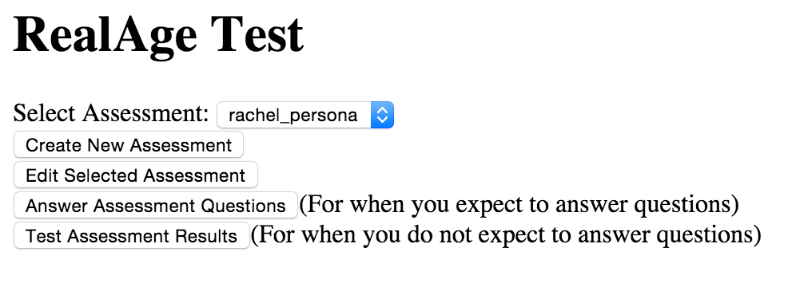
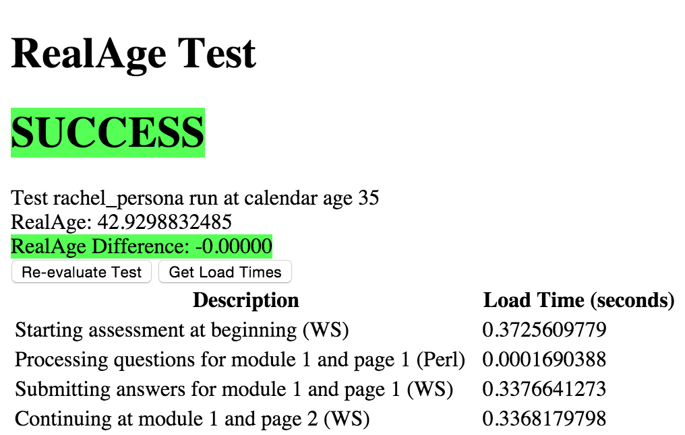
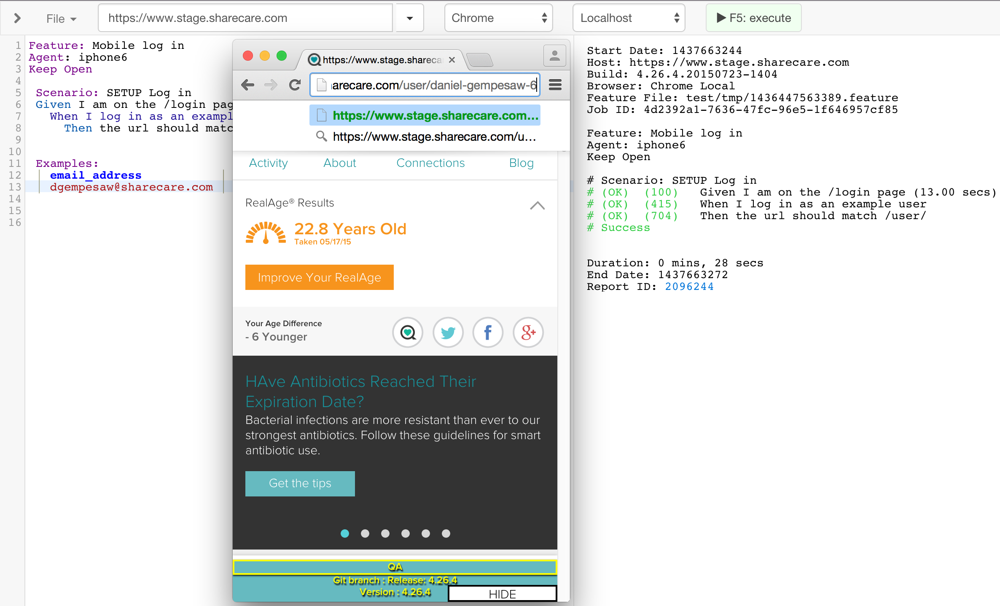

## Kabocha

[Kabocha] is our micro-service testing framework, led by Jay
Heinlein. Kabocha verifies our micro-services, and it gives us
reliable feedback within seconds about a new build's validity. This
way, we can push back on a build immediately, instead of waiting for
it to come up in a manual test later.

Kabocha also has an excellent test
[harness for the new RAT microservices][krat]. The harness enables us
to record a traversal of any RAT assessment and then re-run that
traversal, asserting that the exact same question path is fulfilled
and that the RealAge does not deviate outside of expected bounds.

[ ][krat]

## Honeydew

[Honeydew] is an E2E browser testing framework based on [Selenium]. We
write tests in a readable English-language syntax, which means
everyone can read, compose, and understand the features - They're our
documentation about the site and tests all at once. Honeydew includes
functionality for:

- automated testing of native mobile apps (iOS & Android)

- emulation of mobile browsers for efficient mobile testing

- screenshot comparison to catch visual CSS regressions

- integrating with CI to run core automation for new builds immediately

- 24/7 monitoring against production for critical functionality

- nightly test suite execution (3000+ tests) for comprehensive daily
  feedback on builds

- analytics tests for Omniture, Google Analytics, Comscore, etc to make
  sure we're tracking what we think we are

Honeydew can drive browsers wherever there is a Selenium Webdriver jar
running: your desktop, someone else's desktop, and SauceLabs are all
potential candidates for this.

[][Honeydew]

Honeydew and Kabocha both use a mixture of Perl and PHP on the backend,
and both use AngularJS heavily for their frontends.

[Kabocha]: https://honeydew.be.jamconsultg.com/kabocha
[krat]: https://honeydew.be.jamconsultg.com/kabocha/ratm.html#/assessments
[Honeydew]: https://honeydew.be.jamconsultg.com/
[Selenium]: http://www.seleniumhq.org
